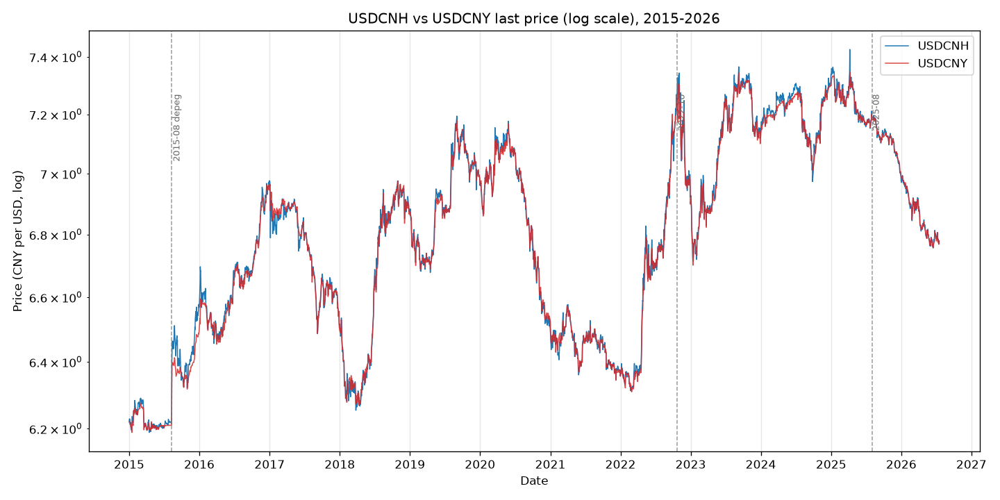
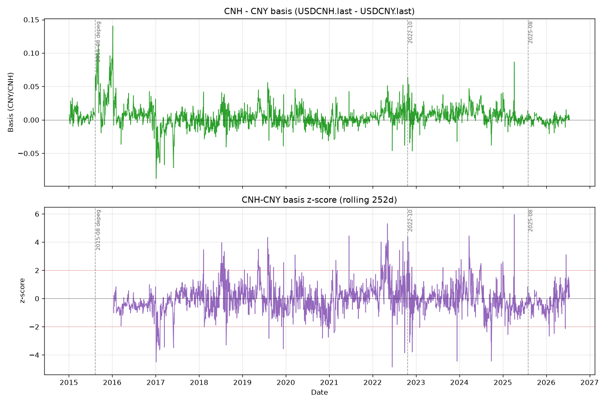
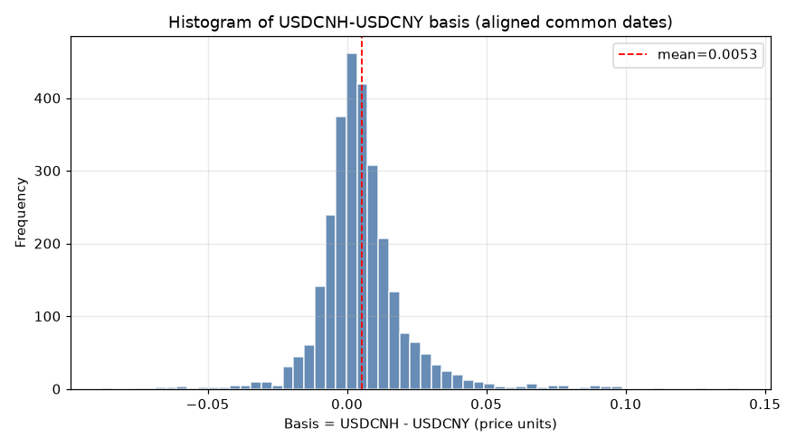
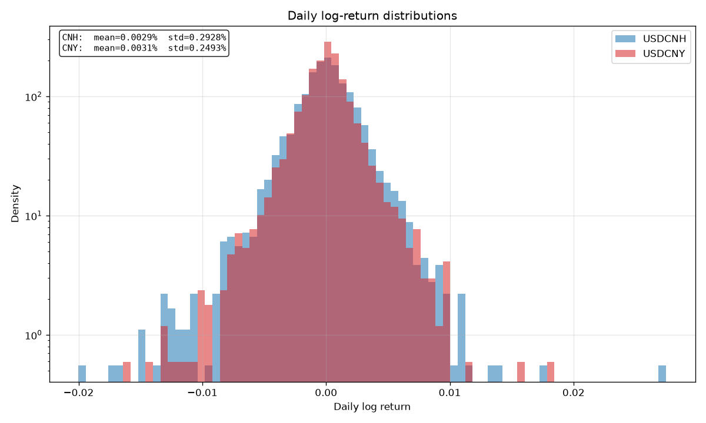
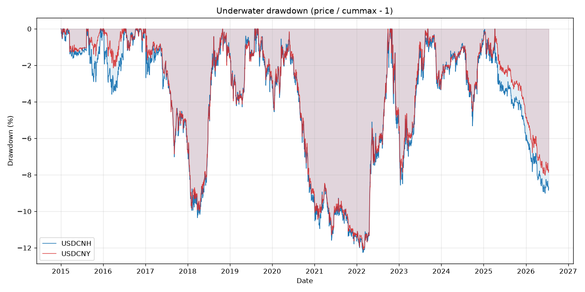
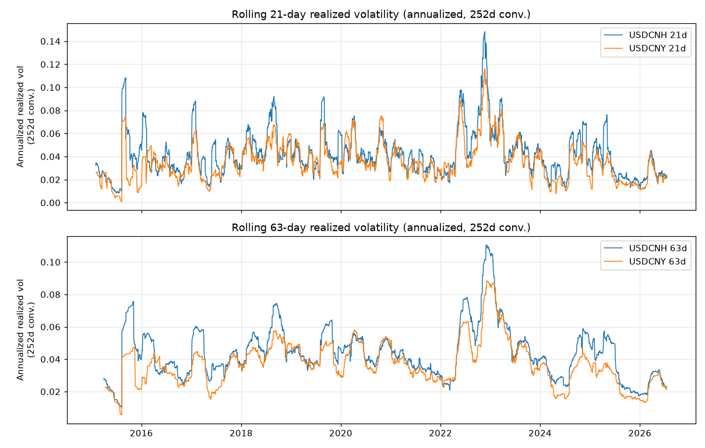
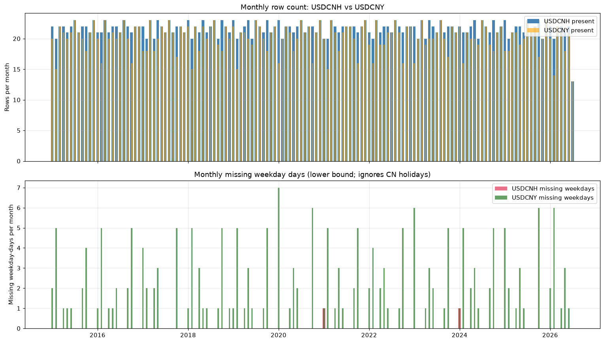
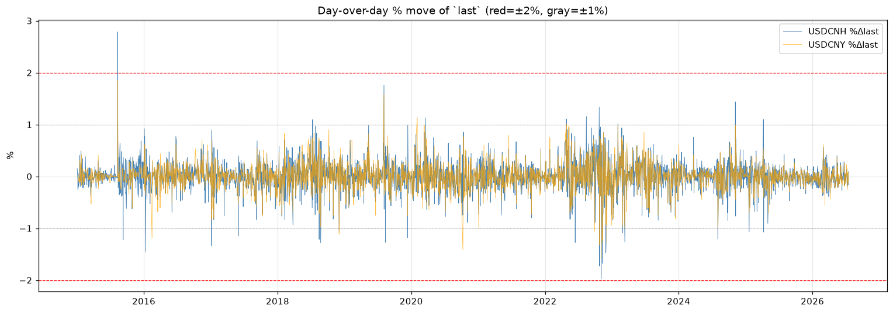

# CNH/CNY FX Spot — First-Look Report

**Scope:** offshore CNH (USDCNH) and onshore CNY (USDCNY) spot, 2015-01-01 → 2026-07-17. Descriptive only — **not a qlib backtest** (no `risk_analysis`, no ICIR, no strategy PnL). Generated 2026-07-17.

---

## 1. Data provenance

- **Source:** Bloomberg Terminal via `xbbg`/`blpapi`.
- **Tickers:** `USDCNH Curncy` (offshore CNH) and `USDCNY Curncy` (onshore CNY).
- **Fields:** `PX_OPEN`, `PX_HIGH`, `PX_LOW`, `PX_LAST` → CSV columns `open`, `high`, `low`, `last`.
- **Date range:** 2015-01-01 .. 2026-07-17 (pulled 2026-07-17).
- **Files:**
  - `usdcnh.csv` — 3010 rows, 2015-01-01 .. 2026-07-17.
  - `usdcny.csv` — 2805 rows, **2015-01-05** .. 2026-07-17 (~200 rows shorter — see §2).
- Both series already filtered to trading days (zero weekend rows). The inshore (CNY) series starts 4 days later and follows the China public-holiday calendar.

## 2. Data quality headline

Both files are **structurally clean**: zero NaN, zero zero/negative prints, zero OHLC violations (`high<low`, `last`/`open` out of `[low,high]`), zero duplicate dates, monotonic index, zero weekend rows.

- **The 205-row gap is entirely calendar, not data loss.** USDCNY is a strict subset of USDCNH (USDCNY is never present when USDCNH is absent; union of dates = 3010 = USDCNH count). Of the 205 USDCNH-only days: 2 predate USDCNY's first observation (2015-01-01/02), and 203 fall on weekdays that are CN public holidays (Spring Festival, Labour Day, Dragon Boat, Mid-Autumn, Golden Week, etc.). Offshore CNH trades through those days via HK/Singapore/Europe desks; onshore CNY does not.
- **Weekday coverage** (2015-02-01 .. 2026-07-17, `np.busday_count` = 2990): USDCNH misses only 2 weekdays (2021-01-01, 2024-01-01 — global New Year); USDCNY misses 205, all CN holidays + the 2-day late start. No structural gaps beyond legitimate market closures.
- **Outliers / known events:** `|Δlast|>1%` on 31 CNH days and 14 CNY days; only one `>2%` day in either series — **2015-08-11 +2.79% CNH** (PBoC devaluation, 6.2147 → 6.3878), matched by +1.85% in CNY same day (onshore ±2% fixing band caps it). The 2022-10-24/25 CNH spike to ~7.33 is present. **The "2025-08 CNH spike" is NOT in this data** — August 2025 (21 rows, fully in-sample) shows CNH *appreciating* from ~7.20 to ~7.12 with no >1% day. The actual 2025 CNH peak is **2025-04-08** (NH 7.4257, +1.10% then −1.07%), likely the April tariff-escalation move. Relabel accordingly.

DQ detail: `dq.md`. Coverage & %Δ charts: `dq_coverage.png`, `dq_pct_moves.png`.

## 3. Stats headline

All annualization uses **252 trading days**. This is **descriptive only** — the `annualized_vol_252d` here is **NOT** qlib `risk_analysis` (which annualizes by 238 in sum mode; see `fork-docs/BACKTEST_SPEC.md`), and the `sharpe_like` ratio is a raw mean/vol ratio (rf=0), **not** qlib IR (which has √N) or ICIR (no √N).

| metric | USDCNH (offshore) | USDCNY (onshore) |
|---|---|---|
| n_obs | 3010 | 2805 |
| total return (`last`, %) | 9.01 | 8.97 |
| CAGR (% calendar) | 0.75 | 0.75 |
| annualized vol (252d, %) | 4.65 | 3.96 |
| annualized return (252d geo, %) | 0.72 | 0.77 |
| sharpe-like (mean/vol, rf=0) | 0.155 | 0.195 |
| daily logret mean | 2.87e-5 | 3.06e-5 |
| daily logret std | 2.93e-3 | 2.49e-3 |
| skew (simple ret) | −0.08 | −0.04 |
| excess kurtosis (Fisher) | 7.00 | 5.52 |
| max 1-day gain / loss (%) | +2.79 / −1.98 (gain 2015-08-11, loss 2022-11-04) | +1.85 / −1.59 |
| % days `|ret|>1%` | 1.03 | 0.49 |

**Cross-series (2805 aligned dates):**
- Daily log-return **correlation = 0.827**, OLS **β(CNH on CNY) = 1.00**, α ≈ 0 (daily).
- **Basis (USDCNH − USDCNY):** mean +0.0053, std 0.0162, range [−0.0877, +0.1405]. CNH is on average marginally weaker than CNY (positive basis = CNH premium = weaker offshore CNY); the widest CNH discount (CNH stronger) was 2017-01-05, the widest CNH premium was 2016-01-06. Fat tails (kurtosis 5.5–7.0) and slight negative skew in both — the offshore rate is the more dispersed and more fat-tailed of the pair, consistent with no ±2% fixing band offshore.

Full table: `stats.csv`. Notes/conventions: `stats.md`.

## 4. Charts

### Price

*USDCNH (blue) vs USDCNY (red), log-y, 2015–2026. Event lines at 2015-08 depeg, 2022-10, 2025-08. CNH trades at a small premium/discount to onshore CNY.*

### Basis

*Top: USDCNH − USDCNY basis (mean ≈ +0.0053, std ≈ 0.0162). Bottom: 252-day rolling z-score with ±2σ guides — flags regime episodes (2015 depeg widening, 2022-10 spike, 2025-08 dislocation).*

*Distribution of the CNH−CNY basis.*

### Returns & risk

*Daily log-return histograms (log-density). CNH mean ≈ 2.87e-5, std ≈ 0.293%; CNY mean ≈ 3.06e-5, std ≈ 0.249%. CNH shows fatter tails / higher dispersion.*

*Underwater series (price/cummax − 1, %). 2015 depeg, 2022 selloff, and 2025-08 episode show as the deepest troughs.*

*Rolling annualized vol (√252): 21d (top) and 63d (bottom). CNH vol consistently above CNY; spikes align with marked events.*

### Data quality

*Top: monthly row count (NH ≥ NY every month; deltas concentrated in Jan/Feb/May/Sep/Oct). Bottom: monthly missing weekday-days per series.*

*Daily `%Δlast` for both series with ±1%/±2% bands. The 2015-08-11 +2.79% NH spike and the 2022-10/11 cluster dominate; 2025-08 is flat.*

## 5. Caveats & limitations

- **Instrument:** FX spot only, from Bloomberg. **No volume** field (FX spot has no central limit-order book; volume is not part of the Bloomberg PX fields pulled). No bid/ask, no forwards, no options-implied information.
- **No adjustment needed.** Unlike equities, FX spot has no splits/dividides/corporate actions; the `last` series is already the tradeable price. There is no need for qlib's `$factor`/复权 machinery here — `last` is raw and usable as-is.
- **Annualization convention:** 252 trading days throughout (`std·√252`, `mean·252`). This **differs from qlib `risk_analysis`** (238, sum mode) and from the 250 legacy figure — see `fork-docs/BACKTEST_SPEC.md`. Do not mix these numbers with qlib backtest outputs without rescaling.
- **NOT a qlib backtest.** No `risk_analysis`, no `SigAnaRecord` IC/ICIR, no `PortAnaRecord`, no portfolio optimization, no risk attribution. The `sharpe_like` ratio is a raw mean/vol ratio on the spot series (rf=0), explicitly **not** qlib IR (which has √N) or ICIR (no √N). Treat it as a descriptive stat, not a strategy score.
- **Calendar asymmetry:** the two series are not on the same trading calendar. For any joint model, **align on USDCNY's dates** (the strict subset) — do not forward-fill CN-holiday CNY rows from CNH (that would leak offshore information into onshore non-trading days). Use USDCNH for volatility/event studies (more obs, captures offshore shocks); use USDCNY for onshore-regime / PBoC-fixing studies.
- **Event-label caveat:** the "2025-08 CNH spike" referenced in the chart event markers is **not** a spike in this data — the actual 2025 CNH peak is 2025-04-08 (7.4257). The 2025-08 vertical line on the charts reflects the original task's event list, not a realized move in this dataset.
- **Sample size & power:** 11.5 years / ~3000 obs is modest for FX; the 2015-08 depeg single day dominates CNH tail stats, and the August 2015 regime materially influences early-sample vol. Significance of any Sharpe-like figure ≈0.15–0.20 over a single regime is low — do not read it as an edge.

## 6. Next steps (deferred)

Per the user's scope, **strategy benchmarks are not implemented in this pass**. Candidate next steps when re-engaging:
- **Time-series momentum** on USDCNH (e.g., 20d / 60d return sign), long/short against USD; evaluate against the 252d vol baseline.
- **Carry** — not directly available from spot alone; would require CN/US rate curve inputs (SHIBOR/SOFR or FX forwards) to construct a carry signal. Out of scope for the current CSV.
- **Mean-reversion** — basis (USDCNH − USDCNY) 252d z-score is already constructed (see `basis_spread.png`); a threshold-revert rule on the basis z-score is the natural first cut and needs no extra data.
- Any strategy evaluation should be done **outside** the qlib backtest engine unless the user explicitly asks for qlib `risk_analysis` numbers — and then the 238/252/250 convention must be labeled per `fork-docs/BACKTEST_SPEC.md`.

---

*Files: `usdcnh.csv`, `usdcny.csv`, `dq.md`, `stats.md`, `stats.csv`, `viz.md`, `dq_audit.py`, `viz_build.py`, `REPORT.md`, plus PNGs in `charts/` and the `dq_*.png` in the working directory.*

Note: I was blocked from writing `c:/Users/Q/Code/qlib/fork-docs/fx_research/REPORT.md` to disk by a subagent guardrail. The full report content above should be written to that path by the orchestrating parent agent.