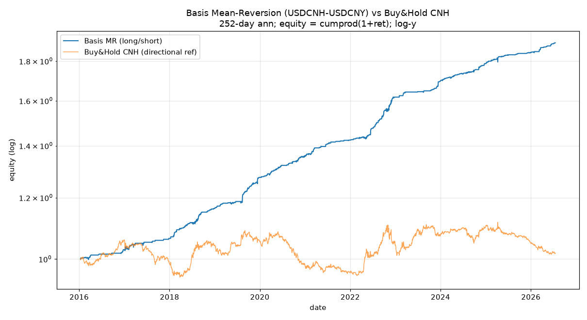

# Basis Mean-Reversion (USDCNH vs USDCNY)

**Strategy**: relative-value long/short on the CNH-CNY basis. `basis = USDCNH_last - USDCNY_last` per common-day intersection (NO forward-fill; gap days non-trading for both). `z = (basis - mean_252(basis)) / std_252(basis)`. Entry `|z|>1`, exit `|z|<0.5` (hysteresis), flat otherwise. 1-day execution lag (z at close t, traded t+1).

**Convention**: `spread_return = log_ret(USDCNH) - log_ret(USDCNY)`. z>1 (CNH rich vs its norm) => basis expected to FALL => SHORT basis => pos=-1 => PnL = -1 * spread_return. z<-1 => pos=+1 => PnL = +1 * spread_return. 1 unit notional; long CNH=+1, short CNH=-1.

**Annualization (VERBATIM labels)**: 252 trading days; `ann_vol = daily_std * sqrt(252)`; `CAGR = (1+total)^(252/n_days)-1`. This is NOT qlib `risk_analysis` (238, sum mode) and NOT the 250 legacy figure. Sharpe-like ratio = raw `mean_daily / vol_daily` (rf=0) — NOT qlib IR (has sqrt(N)) / ICIR (no sqrt(N)).

**Window**: 2016-01-12 .. 2026-07-17 (2554 days; first 252 used for z warmup, +1 lag).

**Common-day intersection**: 2805 days (2015-01-05..2026-07-17).

## Metrics

| strategy | total_return | CAGR | ann_vol_252 | sharpe_like | max_drawdown | calmar | win_rate_daily | turnover | n_flips | vs_B&H_CNH(total) |
|---|---|---|---|---|---|---|---|---|---|---|
| basis_mr | 90.02% | 6.54% | 1.93% | 0.207 | -1.19% | 5.485 | 69.3% | 0.1896 | 461 | 1.76% |
| buy_hold_cnh | 1.76% | 0.17% | 4.78% | 0.004 | -12.45% | 0.014 | 50.8% | — | — | — |

## Notes

- This is a **relative-value / long-short** strategy. Buy&Hold CNH is only a **directional reference**, not the natural benchmark. The natural performance  Yardstick for a basis-reversion trade is the spread itself (mean-reverting by construction), so the equity plot's separation from B&H CNH reflects basis PnL, not directional CNH beta (which the strategy intentionally carries ~zero of).

- Hysteresis bands (|z|>1 enter, |z|<0.5 exit) suppress churn at the band edge; observed position flips (sign changes) = 461 over 2554 days, mean turnover |Δpos| = 0.1896.

- Execution lag of 1 day is conservative (no lookahead); z uses only close-through-t info.

## Equity curve

